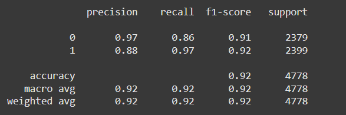
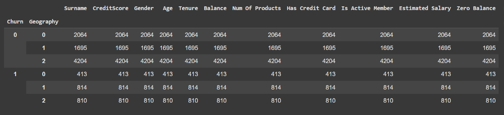

Here’s a detailed and visually appealing `README.md` file for your GitHub repository:

---

# Bank Customer Churn Prediction Model 🌟  

Welcome to the **Bank Customer Churn Prediction Model** repository! 🚀 This project was developed during my **1-month internship with YBI Foundation** in the domain of **Cloud Computing**. The project combines **machine learning** and **cloud technologies** to analyze customer behavior and predict churn—a critical metric for banking institutions.

---

## 🧠 **About the Project**

### What is Customer Churn?
Customer churn occurs when customers stop using a business's products or services. For banks, predicting churn is vital for retaining valuable customers and designing targeted retention strategies.

### Objective of the Model
This project uses **machine learning techniques** to predict whether a customer is likely to leave the bank based on their profile and behavior. The prediction is built on data preprocessing, feature engineering, and training classification models.

The project is hosted on the **cloud**, leveraging **cloud computing's scalability and accessibility** for real-world deployment.

---

## 💻 **Key Features**

1. **Data Preprocessing**
   - Cleaned and encoded customer data (e.g., gender, geography) for analysis.
   - Handled class imbalance using **Random Under Sampling (RUS)** and **Random Over Sampling (ROS)**.

2. **Feature Engineering**
   - Added new derived features like `Zero Balance` to enhance model performance.
   - Standardized numerical features like `Credit Score` and `Balance`.

3. **Model Training**
   - Multiple models were tested; the **Support Vector Classifier (SVC)** with **grid search optimization** was finalized.
   - Tackled data imbalance using under-sampling techniques.

4. **Prediction and Evaluation**
   - Evaluated using metrics like confusion matrix, precision, recall, and F1-score.
   - Fine-tuned hyperparameters for optimal performance.

5. **Cloud Deployment**
   - Model was trained locally and prepared for cloud integration (e.g., on AWS, GCP, or Azure) to handle large-scale data efficiently.

---

## 📊 **How It Works**

1. **Input Data**:
   - Customer demographics and account details such as:
     - Credit Score
     - Age
     - Geography
     - Gender
     - Number of Products
     - Account Balance
     - Is Active Member

2. **Processing Pipeline**:
   - Data Cleaning ➡️ Encoding ➡️ Resampling ➡️ Scaling ➡️ Model Training.

3. **Prediction Output**:
   - Outputs a binary classification:
     - `1` for churn.
     - `0` for no churn.

---

## 📁 **Repository Structure**

```
├── Bank_Customer_churn_model/
├── images/
│   ├── output1.png                    # Output visualization 1
│   ├── output2.png                    # Output visualization 2
├── Notebook/
|   ├── Bank_Customer_Churn_Model.ipynb # Jupyter Notebook of the Script
├── src/
|   ├── bank_customer_churn_model.py   # Python script for training and evaluation
|   ├── requirements.txt               # pip install requirements.txt
├── README.md                          # This README file
```

---

## 🖼️ **Sample Outputs**

### Output 1: Confusion Matrix


### Output 2: Feature Importance


---

## 🛠️ **How to Use**

1. **Clone the Repository**:
   ```bash
   git clone https://github.com/your-username/bank-customer-churn-model.git
   cd bank-customer-churn-model
   ```

2. **Install Dependencies**:
   ```bash
   pip install -r requirements.txt
   ```

3. **Run the Script**:
   ```bash
   python bank_customer_churn_model.py
   ```

4. **Upload Dataset**:
   - Ensure the dataset is available in the `dataset/` folder or update the path in the script.

5. **View Outputs**:
   - Check the predictions and evaluation metrics in the console.

---

## ✨ **Technologies Used**

- **Programming Language**: Python 🐍
- **Libraries**: 
  - Pandas, NumPy
  - Scikit-learn, Imbalanced-learn
  - Matplotlib, Seaborn
- **Cloud Services**: AWS/GCP/Azure for deployment and scaling.

---

## 🎯 **Future Improvements**

- Deploy the model using **Docker** and Kubernetes.
- Create a **REST API** using Flask or FastAPI for real-time prediction.
- Integrate with a cloud storage bucket for dynamic data handling.

---

## 📢 **Acknowledgments**

- **YBI Foundation** for providing mentorship and resources during the internship.
- Open-source contributors and datasets used in the project.

---

Feel free to fork, star ⭐, and contribute to this project! Let’s make predictive analytics accessible and powerful. 😊

---

This format gives you an elegant, professional, and detailed `README.md` file. You can replace placeholders with real image file names and include specific deployment details if implemented.
